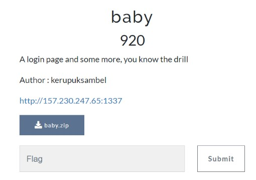
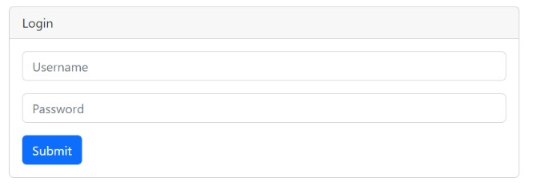
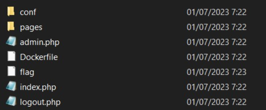
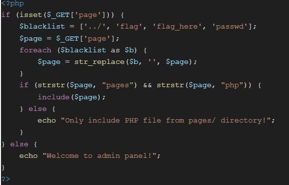
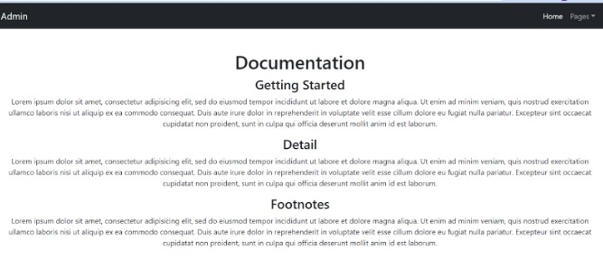
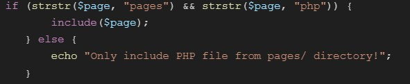
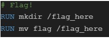
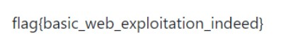

# Baby

> A login page and some more, you know the drill



Download [source code](files/baby.zip)

## Solve

Diberikan sebuah website dan source code dari web tersebut, berikut adalah tampilan websitenya



Terlihat pada index hanya ada sebuah login page, sekarang mari kita lihat ke dalam source code yang diberikan



Disini terlihat terdapat beberapa file dan beberapa folder, mari kita coba buka satu file yaitu admin.php



Terdapat sebuah $_GET parameter dan sebuah blacklist string yang diterapkan pada value parameter tersebut, namun setelah saya check tidak ada ditemukan adanya `session_start()` pada code yang artinya kita bisa mengakses file admin.php tanpa harus login terlebih dahulu



Dan benar saja kita bisa mengakses admin tanpa harus login, dan sepertinya pada parameter “?page” rentan dengan LFI (Local File Inclusion), tapi dapat dipahami bahwa terdapat blacklist dan apabila kita mencoba mengganti value dari parameter maka tidak dapat dilakukan eksekusi payload



Yang berarti kita tidak bisa melakukan traversal dengan cara menghapus “pages/” dari value parameter, solusi untuk melakukan traversal ialah seperti ini `pages/php/../../../../`
Namun `../` terkena blacklist oleh karena itu kita bypass dengan cara seperti ini `....//`

Kemudian kata - kata seperti `flag` juga diblacklist dan bisa dibypass seperti ini `flflagag` kata `flag` yang ada ditengah akan menghilang dan sisanya bisa menyatu, lalu kita lihat pada bagian dockerfile dimana tempat flag nya disimpan



Selanjutnya kita bisa melihat isi flag dengan payload seperti ini

`http://157.230.247.65:1337/admin.php?page=pages/php/....//....//....//....//....//flflagagflflagag_here_here/flflagag`



```
flag{basic_web_exploitation_indeed}
```