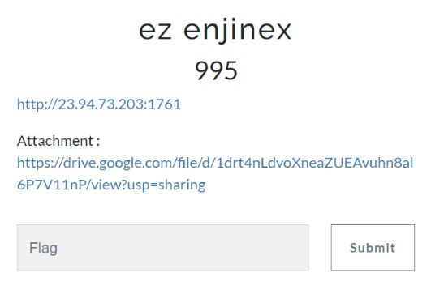
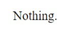
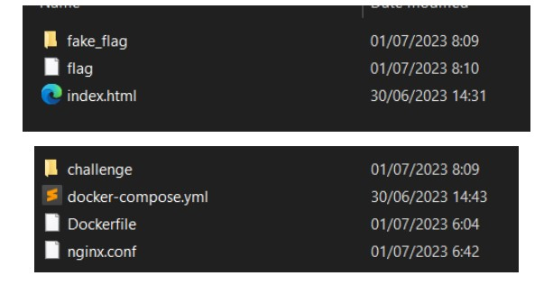
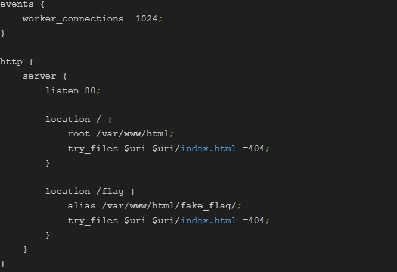
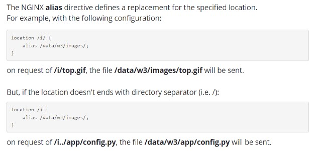
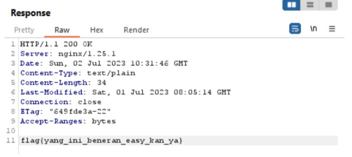

# ez enjinex



Download [source code](files/ez-enjinex-participant.zip)

## Solve

Diberikan sebuah website dan attachment (source code) dari website tersebut, berikut adalah tampilan website



Pada bagian index web hanya terdapat tulisan “Nothing”, kalau begitu mari kita coba buka attachment nya



Terdapat file flag dan direktori fake_flag, kemudian sebuah file konfigurasi dari nginx, karena judul challenge adalah nginx maka saya coba lihat 



Terdapat sebuah `alias` yang apabila diterjemahkan saat kita mengakses /flag maka kita akan diarahkan ke directory /fake_flag

Kemudian saya menemukan artikel sebuah path traversal melalui miskonfigurasi pada nginx [Path Traversal via misconfig Nginx](https://www.acunetix.com/vulnerabilities/web/path-traversal-via-misconfigured-nginx-alias/)



Seperti pada informasi yang diberikan kita bisa melakukan path traversal pada miskonfigurasi `alias` oleh karena itu kita bisa mengakses flag dengan payload seperti ini

`http://23.94.73.203:1761/flag../flag`



```
flag{yang_ini_beneran_easy_kan_ya}
```