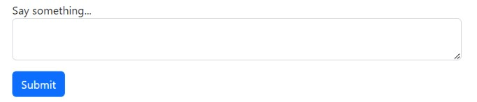
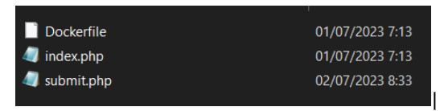

# hummed-soliloquy

> Feel free to say anything


Download [source code](files/soliloquy.zip)

## Solve

Diberikan sebuah website dan attachment (source code) dari website tersebut, berikut adalah tampilan website



Dan berikut adalah isi dari attachment




File yang menarik ada pada app.js dan submit.php, berikut adalah potongan kode


Setelah melakukan static analysis, pada website ini menggunakan library dari axios yang dapat dimanfaatkan untuk kerentanan SSRF (Server-side Request Forgery), lalu pada file app.js diterapkan sebuah potongan kode untuk menangkal modifikasi dari link yang sepertinya bentuk pencegahan terhadap SSRF

Kemudian pada file submit.php untuk mendapatkan response pada backend kita perlu mengisi value dari message dengan string `flag`

Untuk itu kita dapat mengkombinasikan Prototype Pollution + SSRF untuk mendapatkan flag
berikut adalah payload yang diterapkan

`message=flag&constructor/prototype/link=`

Untuk mengetahui dimana letak flag kita perlu membuka file docker compose nya 


Kita bisa langsung mengakses dengan `http://flag:3002/` namun karena terdapat string filter kita bisa mengubah dengan url encode seperti ini

`http://fl%61g:3002/`

sehingga final payload

`message=flag&constructor/prototype/link=http://fl%61g:3002/`


```
flag{s4y_th3_qu1et_p4rt_l0ud3r}
```