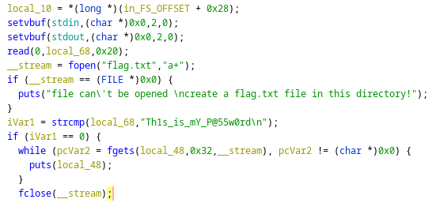

# binex1

Download [file](files/binex_1)

## Solve

Diberikan sebuah file dari hasil compile, selanjutnya kita analysis menggunakan `Ghidra`

Pada function main, terdapat sebuah fungsi strcmp yang gunanya untuk melakukan compare string dan apabila string yang dibandingkan adalah benar maka flag akan muncul



Kita bisa menginputkan string tersebut `Th1s_is_mY_P@55w0rd` atau menggunakan payload seperti ini


Jalankan script


```
flag{now_you_can_use_ida}
```