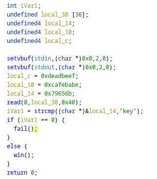
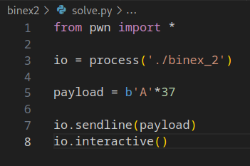
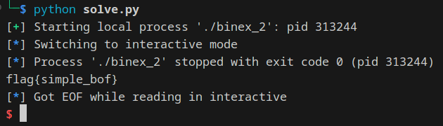

# binex2

Download [file](files/binex_2)

## Solve

Diberikan sebuah file dari hasil compile, selanjutnya kita analysis menggunakan `Ghidra`

Pada function main terdapat beberapa variable yang salah satunya dengan 32 bytes, dan kemudian fungsi strcmp yang membandingkan sebuah kata key dengan sebuah hexadecimal



Karena hexadecimal tersebut apabila diterjemahkan adalah key yang artinya mau di inputkan apapun kita akan masuk ke function `fail()`

Untuk itu kita akan melakukan overflow pada variable input dengan menambahkan 1 byte agar bisa lolos dari fungsi string compare

Berikut adalah script yang digunakan



Jalankan script



```
flag{simple_bof}
```