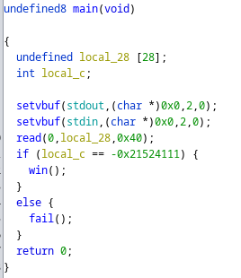
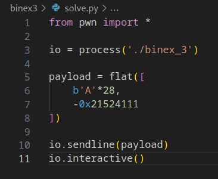
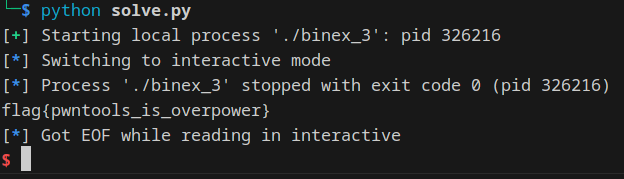

# binex3

Download [here](files/binex_3)

## Solve

Diberikan sebuah file dari hasil compile, selanjutnya kita analysis menggunakan `Ghidra`

Pada function main terdapat variable dengan size 28 bytes dan kemudian variable bawahnya untuk melakukan checker value



Untuk sampai bisa kita ke function win, kita perlu mengisi size input sebanyak 28 bytes dan kemudian menyamakan value dari nilai checker

Berikut ada script yang digunakan



Jalankan script



```
flag{pwntools_is_overpower}
```