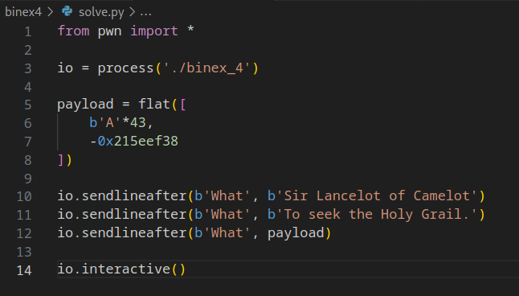

# binex4

Download [here](files/binex_4)

## Solve

Diberikan sebuah file dari hasil compile, selanjutnya kita analysis menggunakan `Ghidra`

Pada function main diberikan sebuah pertanyaan dan input untuk menjawab, terdapat juga fungsi string compare untuk mencocokan jawaban yang benar


Namun pada pertanyaan terakhir variable yang dipanggil untuk melakukan input berbeda, oleh karena itu kita bisa mengisi bytes sesuai size dengan variable input dan menambahkan value yang sesuai agar function `print_flag()` bisa dipanggil

Berikut adalah script yang digunakan



Jalankan script


```
flag{return_oriented_programming}
```