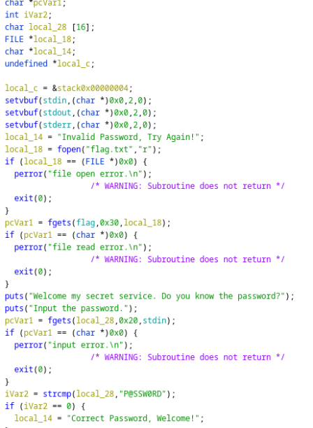
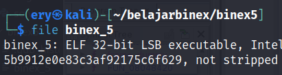
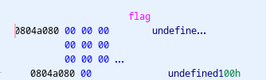
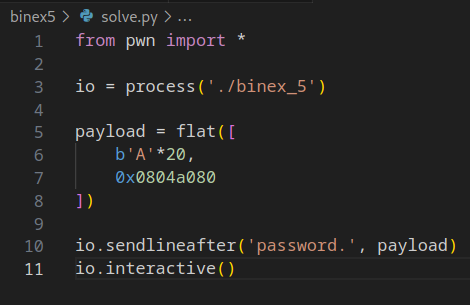
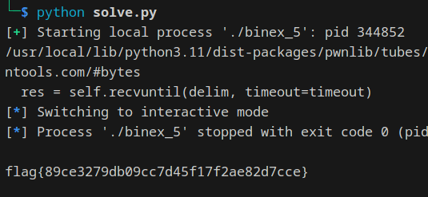

# binex5

Download [here](files/binex_5)

## Solve

Diberikan sebuah file dari hasil compile, selanjutnya kita analysis menggunakan `Ghidra`

Pada function main, terdapat beberapa variable dan sebuah fungsi string compare untuk membandingkan input user



Namun untuk sampai ke tujuan global variable flag kita memerlukan address variable tersebut, sisanya kita hanya perlu melakukan overflow pada variable input

Karena file merupakan 32-bit, kita perlu menambahkan 4 bytes sehingga `16 + 4 = 20`



Untuk menemukan address dari variable flag kita bisa melihatnya dari Ghidra



Berikut adalah script yang digunakan



Jalankan script



```
flag{89ce3279db09cc7d45f17f2ae82d7cce}
```