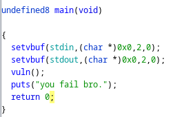
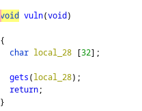
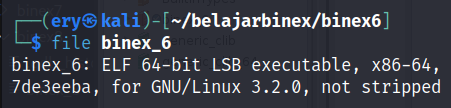
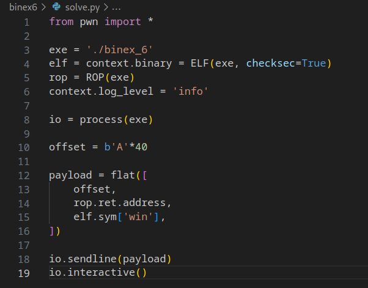
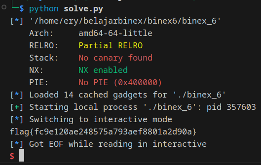

# binex6

Download [here](files/binex_6)

## Solve

Diberikan sebuah file dari hasil compile, selanjutnya kita analysis menggunakan `Ghidra`

Pada function main terdapat function lain bernama `vuln`



Pada function vuln terdapat sebuah variable dengan 32 byte, untuk sampai ke variable win kita perlu melakukan overflow



Karena file merupakan 64-bit, jadi kita perlu menambahkan 8 bytes `32 + 8 = 40`



Selanjutnya kita melakukan jump pada function win

Berikut adalah script yang digunakan



Jalankan script



```
flag{fc9e120ae248575a793aef8801a2d90a}
```