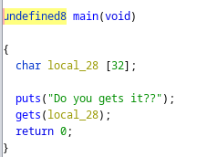
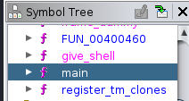
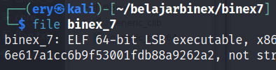
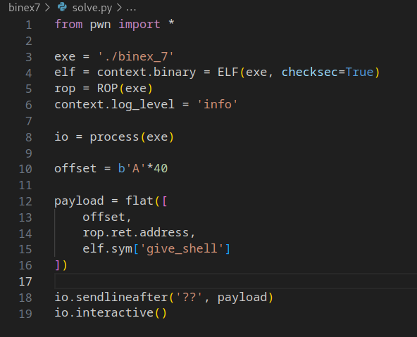
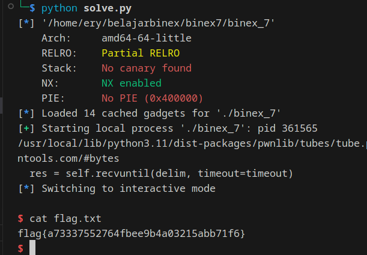

# binex7

Download [here](files/binex_7)

## Solve

Diberikan sebuah file dari hasil compile, selanjutnya kita analysis menggunakan `Ghidra`

Pada function main, terdapat variable dengan ukuran 32 bytes, dan terdapat sebuah function bernama `give_shell`





Agar bisa melakukan jump ke function `give_shell` kita memerlukan overflow pada variable input

Karena file merupakan 64-bit, kita perlu menambahkan 8 bytes `32 + 8 = 40`



Setelah melakukan overflow, kita hanya perlu melakukan jump ke function `give_shell`

Berikut adalah script yang digunakan



Jalankan script



```
flag{a73337552764fbee9b4a03215abb71f6}
```