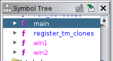
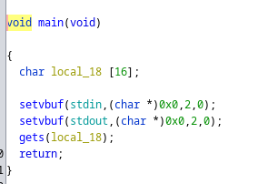
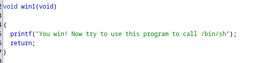
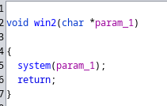
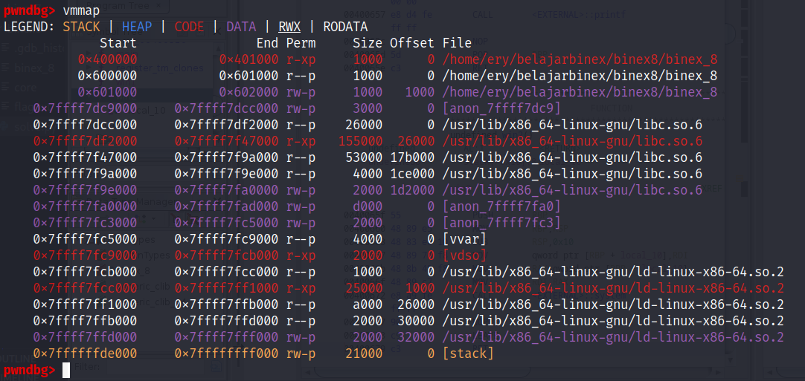
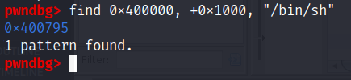
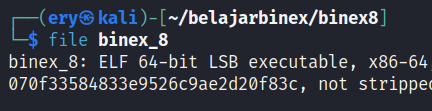
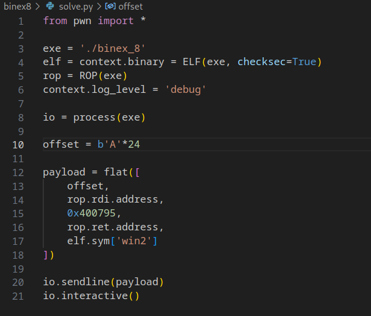
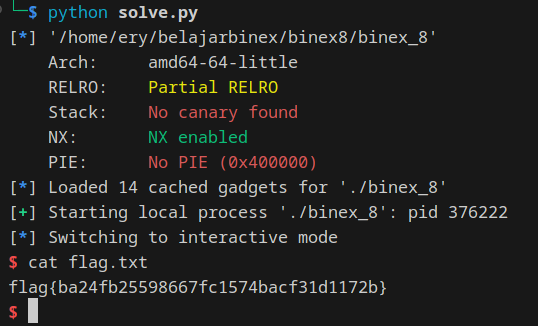

# binex8

Download [here](files/binex_8)

## Solve

Diberikan sebuah file dari hasil compile, selanjutnya kita analysis menggunakan `Ghidra`

Terdapat pada 3 function berbeda di global



Pada function main terdapat variable input dengan size 16 byte



Kemudian pada function win1 dan win2 terdapat keterangan berikut





Sesuai dengan chall kita membutuhkan address dari `"/bin/sh"` kemudian melakukan overwrite kepada argument yang ada pada `win2`

Disini saya menggunakan `gdb-pwndbg` untuk menemukan `"/bin/sh"` dengan command `vmmap`



Dapat terlihat start dan size dari program dengan begitu kita bisa menggunakan command `find` seperti ini `find 0x400000, +0x1000, "/bin/sh"`



Karena hanya dibutuhkan first argument pada win2 kita bisa menggunakan rdi sesuai keterangan [architecture](http://6.s081.scripts.mit.edu/sp18/x86-64-architecture-guide.html)

Karena file merupakan 64-bit, kita memperlukan 8 byte sehingga `16 + 8 = 24`



Berikut adalah script yang digunakan 



Jalankan script



```
flag{ba24fb25598667fc1574bacf31d1172b}
```