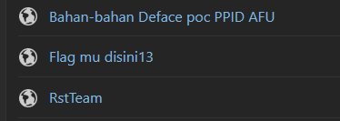

# Aku Dimana 
> Aku Menyimpan Sesuatu Di salah satu website untuk menyimpan potongan-potongan catatan atau kode pemrograman
> Bantu aku menemukannya

## Solve
Ada beberapa yang saya pikirkan untuk menyimpan sebuah potongan program, seperti github, pastebin, dll.
Namun karena yang sering digunakan adalah pastebin maka saya coba seperti ini `https://pastebin.com/u/rajawalisecteam`



Setelah dibuka terdapat text seperti ini `PGSEFG[c4fg3o1a_zl_s4i0e1g]`.
Seperti yang saya kira itu adalah cipher dari ROT-13, maka setelah dilakukan decipher hasilnya adalah
```
CTFRST[p4st3b1n_my_f4v0r1t]
```
