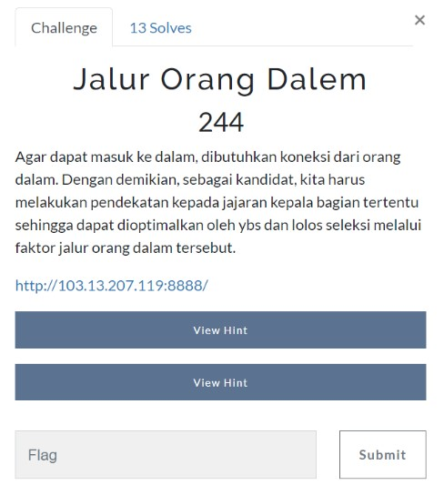
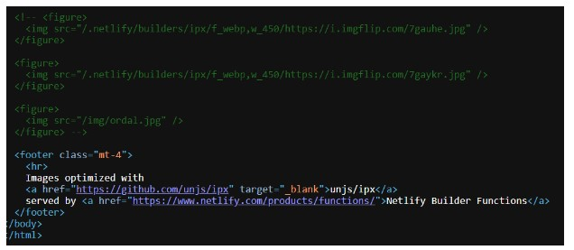
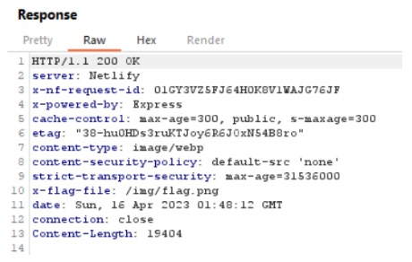
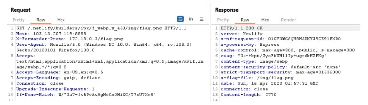
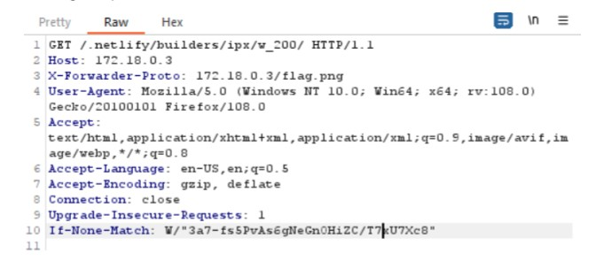
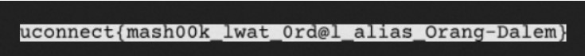

# Jalur Orang Dalem

> Agar dapat masuk ke dalam, dibutuhkan koneksi dari orang dalam. Dengan demikian, sebagai kandidat, kita harus melakukan pendekatan kepada jajaran kepala bagian tertentu sehingga dapat dioptimalkan oleh ybs dan lolos seleksi melalui faktor jalur orang dalam tersebut.



## Solve

Diarahkan ke sebuah website dengan tampilan seperti ini


Check view-source mungkin saja ada hal yang menarik



Sepertinya website ini menggunakan netfily ipx untuk menampilkan gambar, selanjutnya kita buka dengan Burpsuite untuk melihat response nya



Terdapat response yang menunjukan flag file pada directory /img/flag.png, mari kita coba buka


Begitulah isi dari gambar “flag is in the 172.18.0.3”, hal yang terlintas pertama adalah mencoba X-Forwarder-For / X-Forwarder-Host tapi tidak berhasil.
Sampai disini stuck, kemudian terdapat hint dari probset kita tercinta kalau exploit web tersebut berdasarkan CVE.
Dan benar saja terdapat CVE yang menunjukan kerentanan pada library gambar tersebut

[CVE 2022-39239](https://samcurry.net/universal-xss-on-netlifys-next-js-library/)



Setelah dibaca - baca berdasarkan poc nya, Cache poisoning dapat dilakukan dengan menambahkan header “X-Forwarder-Proto”
Gasskaann kita coba


Hmm.. masih ga mau muncul, kenapa tuh kira kira?
Setelah disini muter - muter, ternyata host nya daripada yang asli juga ikut diganti dengan ip attacker (172.18.0.3)



Langsung kita show response in browser



```
uconnect{mash00k_lwat_0rd@l_alias_Orang-Dalem}
```