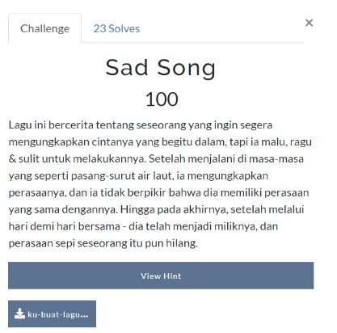
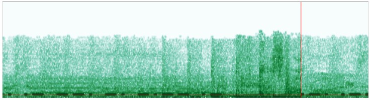
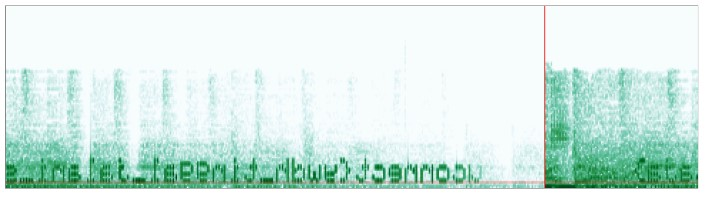
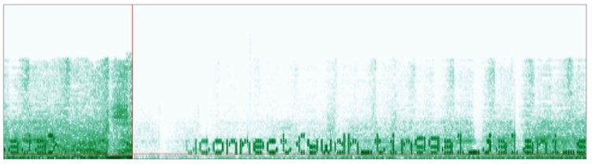

# Sad Song

> Lagu ini bercerita tentang seseorang yang ingin segera mengungkapkan cintanya yang begitu dalam, tapi ia malu, ragu & sulit untuk melakukannya. Setelah menjalani di masa-masa yang seperti pasang surut air laut, ia mengungkapkan perasaanya, dan ia tidak berpikir bahwa dia memiliki perasaan yang sama dengannya. Hingga pada akhirnya, setelah melalui hari demi hari bersama - dia telah menjadi miliknya, dan perasaan sepi seseorang itu pun hilang.




## Solve

Didapatkan file wav yang berisi lagu dan kode morse. Langsung dimasukkan saja ke morse decoder



Namun ketika menunggu sampai habis, ada yang menarik di akhir lagu. Spectogram menunjukkan yang terlihat sebagai flag



Saya screenshot dan mirror gambar tersebut, agar flagnya terlihat lebih jelas



```
uconnect{ywdh_tinggal_jalani_saja}
```