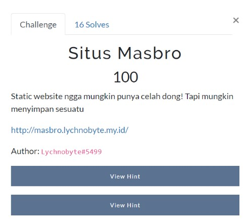
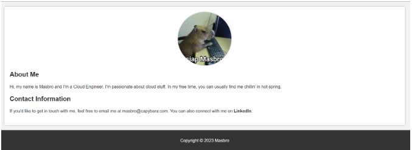
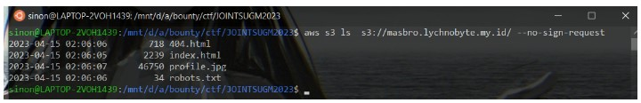
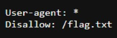
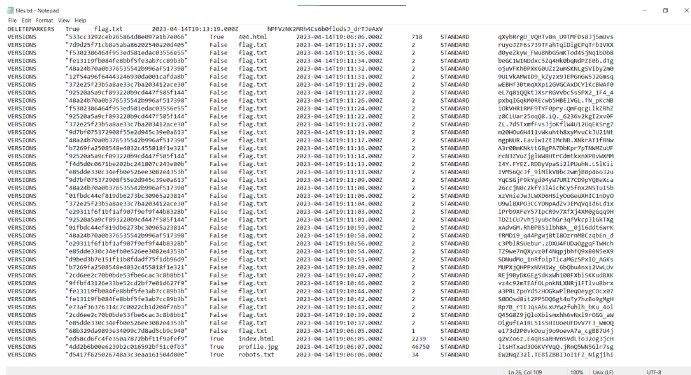
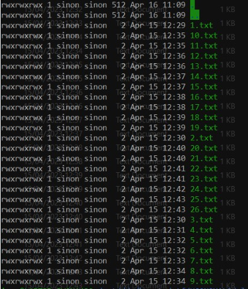

# Situs Masbro

> Static website ngga mungkin punya celah dong! Tapi mungkin menyimpan sesuatu



## Solve

Diberikan website dengan tampilan seperti ini



Karena ini adalah static website, menurut saya pasti ada misconfigurasi pada cloud tersebut.
Karena itu saya membaca write up yang berkaitan dengan chall Cloud terutama AWS

[Flaws Cloud CTF Walkthrough](https://executeatwill.com/2022/01/17/Flaws.Cloud-Walkthrough/
)

Pertama saya coba untuk melihat isi dari file website tersebut menggunakan awscli



File robots.txt sepertinya menarik langsung saja kita buka



Hmm.. saya simpulkan bahwa file flag.txt telah dihapus, langkah selanjutnya saya mencari dokumentasi tentang aws cloud yang bisa melakukan retrieve data yang telah dihapus

[S3 Undelete Configuration](https://repost.aws/knowledge-center/s3-undelete-configuration
)

Setelah itu kita coba retrieve semua list object nya yang sudah didelete

[S3 recover deleted files](https://superuser.com/questions/55688/amazon-s3-recover-deleted-file
)



Disitu terlihat list object flag.txt yang telah dihapus, menurut firasat saya ini nguli, oke gaskan kita nguli satu satu dengan command seperti ini

```aws s3api get-object --bucket masbro.lychnobyte.my.id --key flag.txt --version-id awikawikawok output.txt --no-sign-request```

Sehingga jadi seperti ini



Lalu kita susun flag nya

```
uconnect{ud4h_dih4pus_t4pi_g4_il4ng}
```