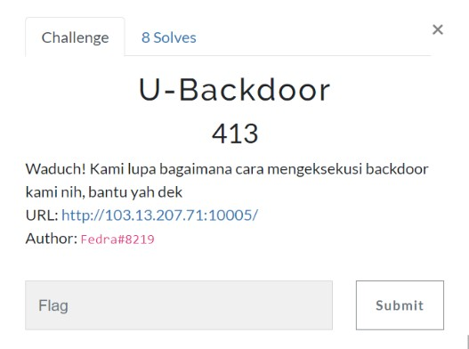
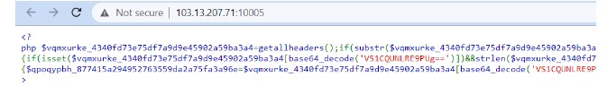
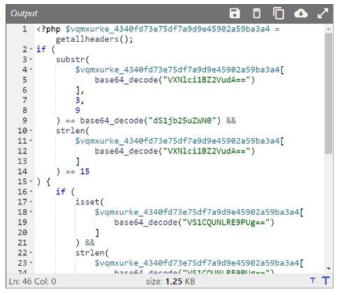
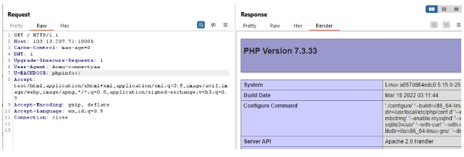
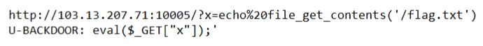
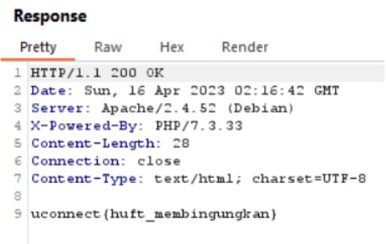

# U-Backdoor

> Waduch! Kami lupa bagaimana cara mengeksekusi backdoor kami nih, bantu yah dek



## Solve

Diberikan website dengan tampilan seperti berikut



Rapikah dulu dengan php prettier agar bisa dibaca



Setelah di analisis ternyata kita perlu memasukan header contohnya seperti header User-Agent yang panjang value nya tidak lebih dari 15 char,
kemudian ada penambahan header U-BACKDOOR yang panjang value nya tidak lebih dari 17.
Ywdah lah yah kita gaskan seperti ini



Nah setelah gini berarti inject pointnya sudah dipastikan lewat header U-BACKDOOR, sisanya gimana cara memanfaatkan panjang value yang tidak boleh lebih dari 17 char?
Bener, pakek eval GET url nya



Langsung check response



```
uconnect{huft_membingungkan}
```