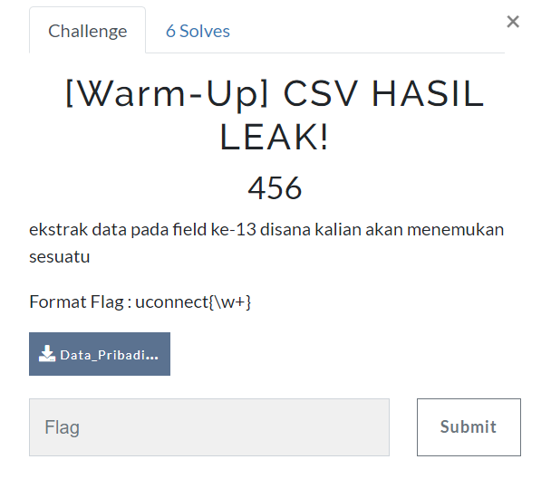
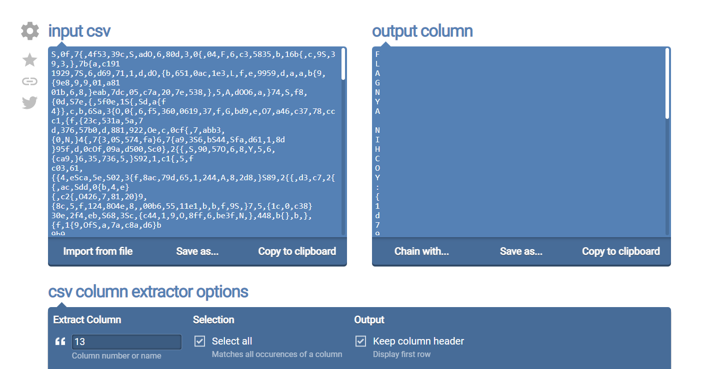
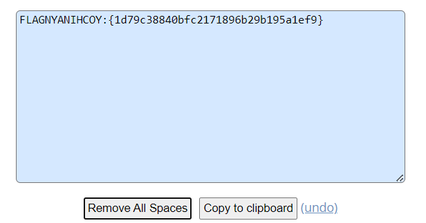

# CSV HASIL LEAK!

> ekstrak data pada field ke-13 disana kalian akan menemukan sesuatu



[file.csv](files/Data_Pribadi.csv)

## Solve

Sesuai dengan deskripsi kita hanya perlu melakukan extract pada column ke-13, dengan menggunakan tool berikut [CSV Column Extractor](https://onlinecsvtools.com/extract-csv-columns)



Didapat sebuah tulisan kemudian kita rapikan dengan remove whitespace



```
uconnect{1d79c38840bfc2171896b29b195a1ef9}
```