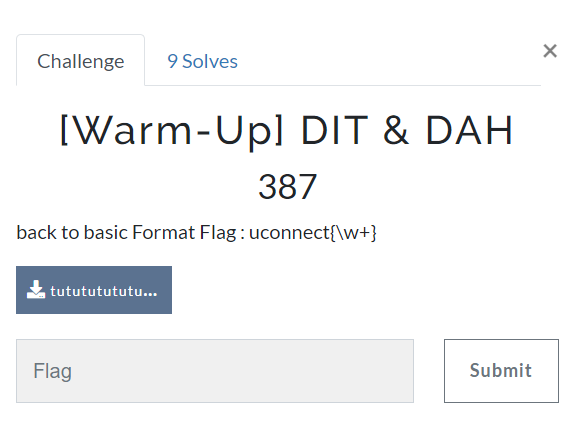
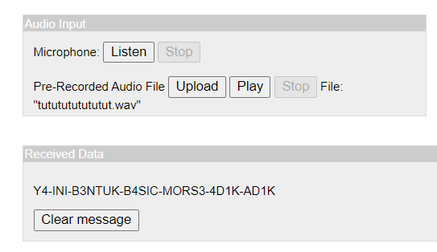

# DIT & DAH

> back to basic



[file.wav](files/tututututututut.wav)

## Solve

Diberikan sebuah file .wav yang berisi morse code, kita hanya perlu menggunakan translator untuk mendapatkan flagnya



```
uconnect{Y4-INI-B3NTUK-B4SIC-MORS3-4D1K-AD1K}
```