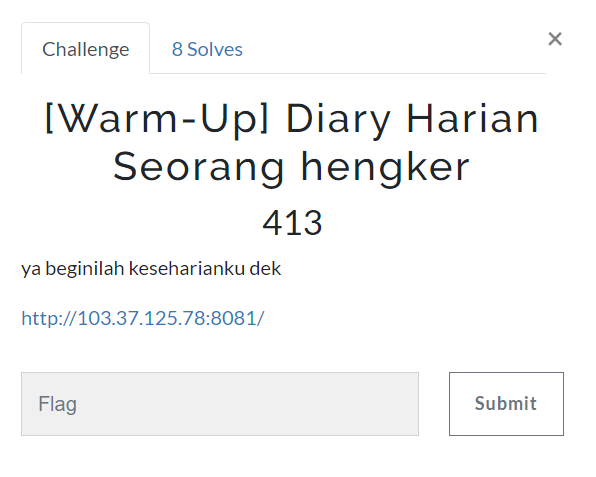
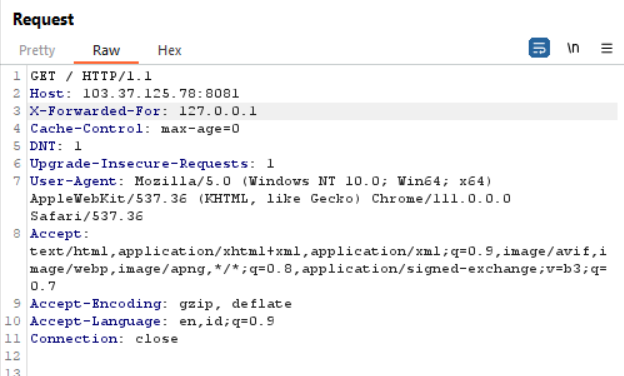
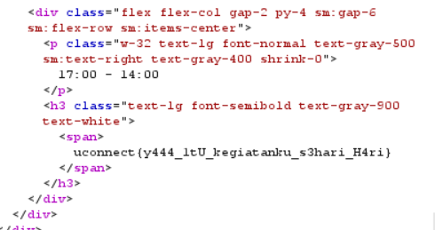

# Diary Harian Seorang hengker

> ya beginilah keseharianku dek
http://103.37.125.78:8081/



## Solve

Berikut adalah tampilan laman web


```Rumah``` yang dimaksud adalah localhost, oleh karena itu saya menggunakan tambahan header ```X-Forwarded-For```



Response akan menunjukan



```
uconnect{y444_1tU_kegiatanku_s3hari_H4ri}
```