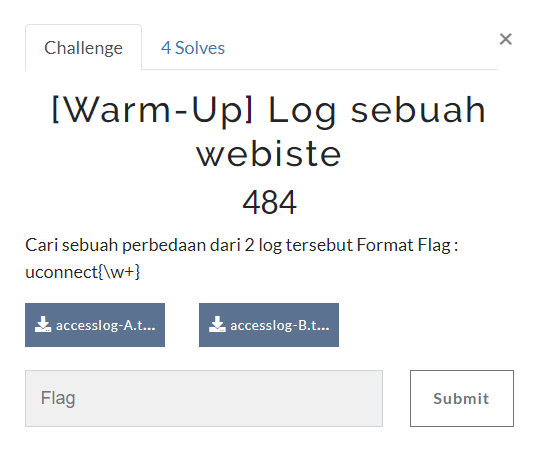
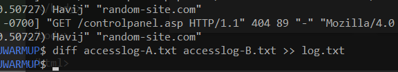
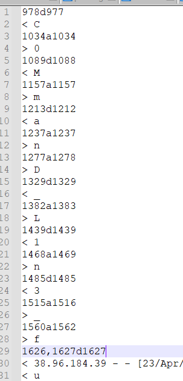
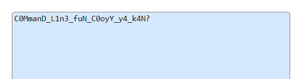

# Log sebuah website

> Cari sebuah perbedaan dari 2 log tersebut Format Flag : uconnect{\w+}



[logA](files/accesslog-A.txt), [logB](files/accesslog-B.txt)

## Solve

Diberikan dua buah log file, sesuai deskripsi mencari perbedaan oleh karena itu saya langsung menggunakan command ```diff``` untuk melihat perbedaan dari kedua file



Setelah itu saya buka di dalam notepad



Sepertinya sudah ada titik terang, namun kita perlu rapikan



```
uconnect{C0MmanD_L1n3_fuN_C0oyY_y4_k4N?}
```