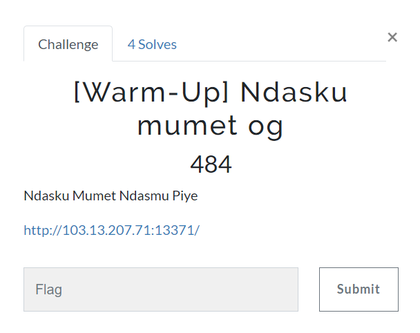
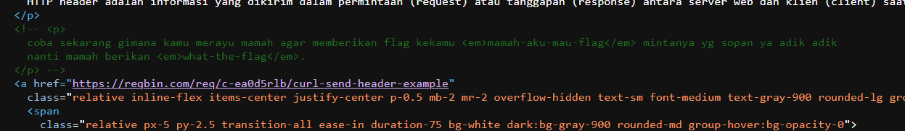
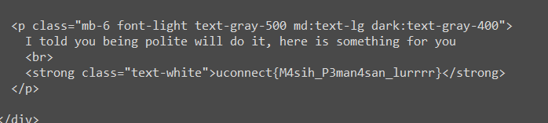

# Ndasku mumet og

> Ndasku Mumet Ndasmu Piye
http://103.13.207.71:13371/



## Solve

Yang pertama dilakukan adalah view-source untuk melihat petunjuk yang berikan



``` coba sekarang gimana kamu merayu mamah agar memberikan flag kekamu <em>mamah-aku-mau-flag</em> mintanya yg sopan ya adik adik nanti mamah berikan <em>what-the-flag</em>. ```

Awalnya saya bingung pada chall ini, namun kemudian saya menambahkan request header baru sesuai dengan petunjuk

> mamah-aku-mau-flag sebagai header name
> what-the-flag sebagai header value

``` curl -H "mamah-aku-mau-flag: what-the-flag" 103.13.207.71:13371 ```



```
uconnect{M4sih_P3man4san_lurrrr}
```