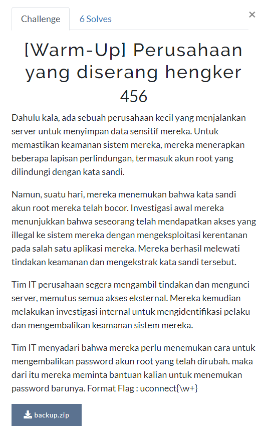
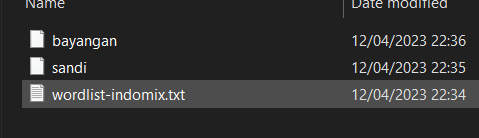
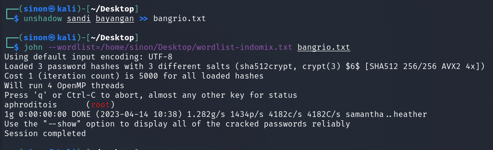

# Perusahaan yang diserang hengker 

> Dahulu kala, ada sebuah perusahaan kecil yang menjalankan server untuk menyimpan data sensitif mereka. Untuk memastikan keamanan sistem mereka, mereka menerapkan beberapa lapisan perlindungan, termasuk akun root yang dilindungi dengan kata sandi.
> Namun, suatu hari, mereka menemukan bahwa kata sandi akun root mereka telah bocor. Investigasi awal mereka menunjukkan bahwa seseorang telah mendapatkan akses yang illegal ke sistem mereka dengan mengeksploitasi kerentanan pada salah satu aplikasi mereka. Mereka berhasil melewati tindakan keamanan dan mengekstrak kata sandi tersebut.
> Tim IT perusahaan segera mengambil tindakan dan mengunci server, memutus semua akses eksternal. Mereka kemudian melakukan investigasi internal untuk mengidentifikasi pelaku dan mengembalikan keamanan sistem mereka.
> Tim IT menyadari bahwa mereka perlu menemukan cara untuk mengembalikan password akun root yang telah dirubah. maka dari itu mereka meminta bantuan kalian untuk menemukan password barunya. Format Flag : uconnect{\w+}



[File.zip](files/backup.zip)

## Solve

Diberikan sebuah file .zip yang didalamnya terdapat 3 file



Setelah saya coba lihat, tiga file tersebut merupakan ```/etc/shadows```, ```/etc/passwd```, dan sebuah wordlist. Saya menyimpulkan bahwa kita harus melakukan bruteforce untuk menemukan password nya dengan menggunakan ```John The Ripper```



```
uconnect{aphroditois}
```