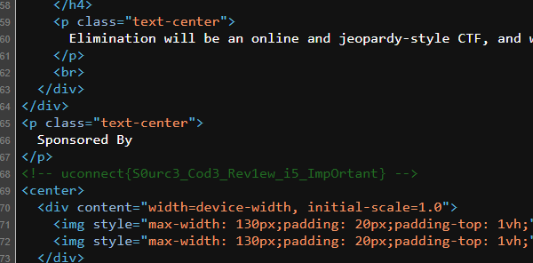

# Source Code Review

> Kegiatan source code review adalah proses melihat dan memeriksa kode sumber suatu program secara menyeluruh untuk menilai kualitasnya dan mencari potensi kesalahan atau celah keamanan. Tujuannya adalah untuk memastikan bahwa kode tersebut memenuhi standar tertentu, dapat dipahami dengan mudah, mudah dipelihara, dan tidak memiliki kerentanan keamanan yang dapat dimanfaatkan oleh pihak yang tidak berwenang.
> Proses source code review dilakukan oleh tim yang berpengalaman dan terlatih dalam melakukan analisis kode. Selama review, mereka akan melihat struktur kode, sintaksis, dan logika pemrograman. Mereka juga akan mencari tanda-tanda kesalahan seperti memori yang bocor, kerentanan keamanan, dan kelemahan performa. Setelah review selesai, tim akan memberikan umpan balik dan rekomendasi untuk perbaikan dan perbaikan kode.
> Kegiatan source code review sangat penting untuk memastikan bahwa program yang dikembangkan adalah berkualitas tinggi, aman, dan dapat dipelihara dengan mudah di masa depan. Ini juga membantu meningkatkan efisiensi dan konsistensi dalam pengembangan perangkat lunak, serta memastikan bahwa kode yang dihasilkan memenuhi standar industri dan praktik terbaik.
> Ayo mulai sekarang kalian juga bisa jadi praktisi source code review, silahkan analisa website dashboard saat ini. kalian bisa menemukan flagnya disana. Format Flag : uconnect{\w+}

## Solve

Pergi ke halaman utama atau index dari website, lalu view-source



```
uconnect{S0urc3_Cod3_Rev1ew_i5_ImpOrtant}
```