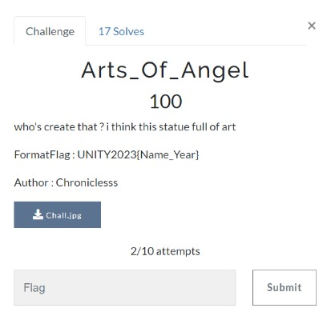
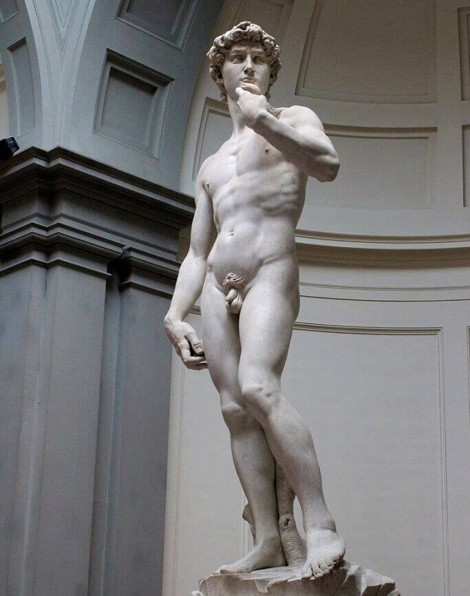
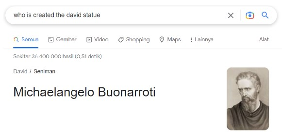
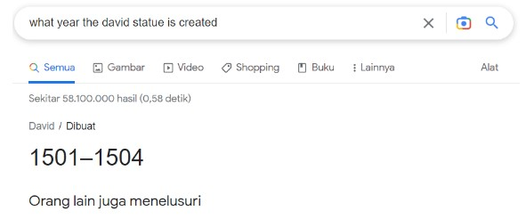

# Arts_Of_Angel

> who's create that ? i think this statue full of art



## Solve

Diberikan sebuah gambar seperti ini



Berdasarkan pada deskripsi soal kita harus mencari nama pembuat patung tersebut dan tahun kapan patung tersebut dibuat.

Setelah saya melakukan searching nama patung tersebut adalah “The David” sekarang kita cari nama pembuatnya.



Nama pembuat sudah kita dapatkan “Michaelangelo”, selanjutnya kapan tahun dibuatnya patung tersebut.



Kita dapatkan “1501” untuk tahun dibuatnya, dan bila digabung untuk flag menjadi seperti ini

```
UNITY2023{Michaelangelo_1501}
```