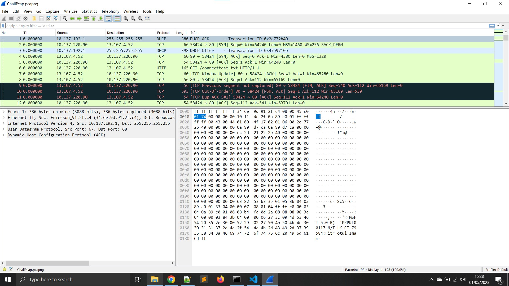
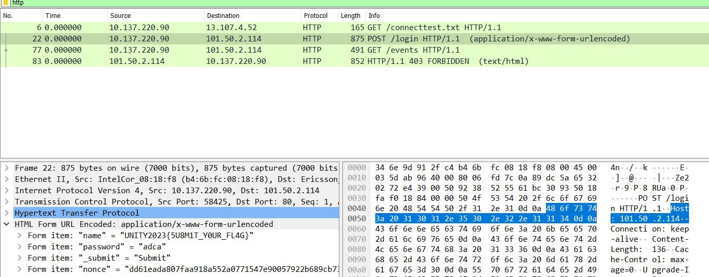

# CPNS

> 

## Solve

Diberikan sebuah file pcap, langsung saja kita buka dengan Wireshark



Karena sesuai deskripsi soal yang berkaitan dengan ```HEAD``` maka saya langsung filter ke protokol HTTP dan kemudian melihat isi dari header requestnya



```
UNITY2023{5U8M1T_Y0UR_FL4G}
```