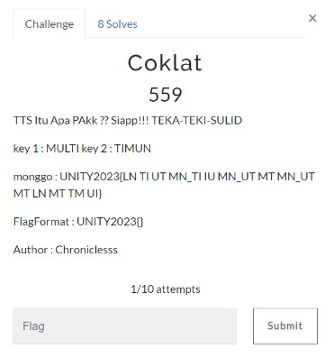
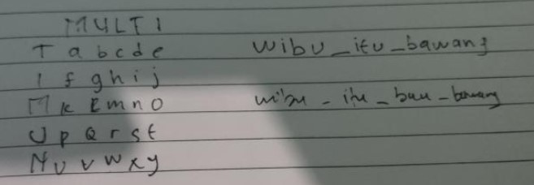

# Coklat

> TTS Itu Apa PAkk ?? Siapp!!! TEKA-TEKI-SULID
key 1 : MULTI key 2 : TIMUN
monggo : UNITY2023{LN TI UT MN_TI IU MN_UT MT MN_UT MT LN MT TM UI}



## Solve

Kita diberikan sebuah 2 key yaitu “MULTI” dan “TIMUN”, lalu sebuah encoding yang seperti kombinasi dari 2 key tersebut.

Sesuai dengan deskripsi yaitu TTS (Teka Teki Sulit) terdapat garis mendatar dan menurun lalu saya menggunakan cara manual ya ges yaa xixixi…



Flag sudah bisa kita dapatkan dengan format UPPERCASE

```
UNITY2023{WIBU_ITU_BAU_BAWANG}
```