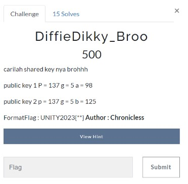
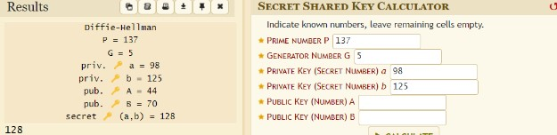

# DiffieDikky_Broo

> carilah shared key nya brohhh
public key 1 P = 137 g = 5 a = 98
public key 2 p = 137 g = 5 b = 125



## Solve

Diberikan sepasang public key untuk enkripsi Diffie-Helman yaitu Alice dan Bob. Sesuai dengan hint yang dicari adalah shared key antara Alice dan Bob oleh karena itu kita bisa menggunakan tool berikut [Dcode.fr](https://www.dcode.fr/diffie-hellman-key-exchange)



Didapatkan resultnya adalah 128, namun itu adalah between shared key untuk mendapatkan shared keynya kita bisa membagi dua dan hasilnya menjadi 64

```
UNITY2023{64}
```