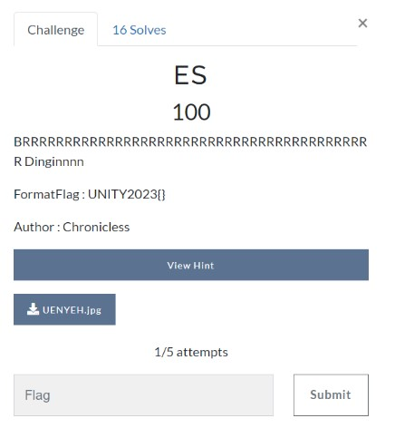
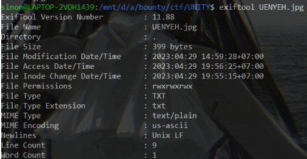
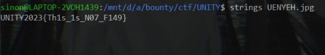

# ES

> BRRRRRRRRRRRRRRRRRRRRRRRRRRRRRRRRRRRRRRRRRR Dinginnnn



[file.jpg](file/UENYEH.jpg)

## Solve

Diberikan sebuah file gambar namun tidak bisa dibuka, setelah itu kita identifikasi file tersebut



Sepertinya file tersebut berbentuk text, jadi saya coba untuk melakukan strings



```
UNITY2023{Th1s_1s_N07_F149}
```