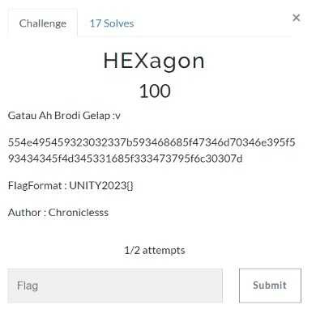
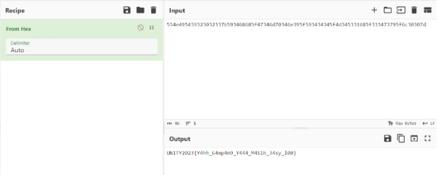

# HEXagon

> Gatau Ah Brodi Gelap :v

> 554e495459323032337b593468685f47346d70346e395f593434345f4d345331685f333473795f6c30307d



## Solve

Kita diberikan sebuah enkripsi, sesuai dengan nama soal kemungkinan adalah hexadecimal, kita gunakan [Cyberchef](https://gchq.github.io/CyberChef/) untuk melakukan decrypt



```
UNITY2023{Y4hh_G4mp4n9_Y444_M4S1h_34sy_l00}
```