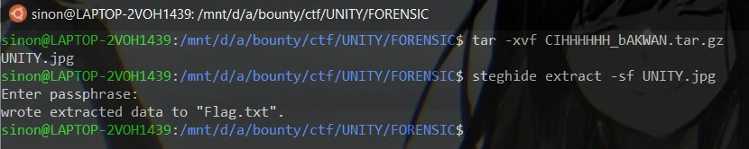
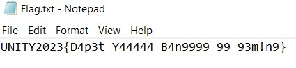

# Ngump3t

> [file.tar.gz](file/CIHHHHHH_bAKWAN.tar.gz)

## Solve

Diberikan sebuah file tar.gz, untuk mendapatkan flag kita hanya perlu extract file tersebut kemudian akan terdapat gambar.

Selanjutnya kita gunakan steghide



Kita coba buka file flag.txt



```
UNITY2023{D4p3t_Y44444_B4n9999_99_93m!n9}
```