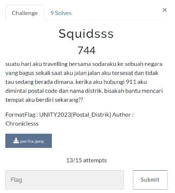
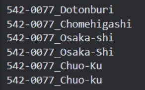

# Squidsss

> suatu hari aku travelling bersama sodaraku ke sebuah negara yang bagus sekali saat aku jalan jalan aku tersesat dan tidak tau sedang berada dimana. kerika aku hubungi 911 aku dimintai postal code dan nama distrik. bisakah bantu mencari tempat aku berdiri sekarang??



## Solve

Diberikan sebuah gambar seperti ini


Berdasarkan pada deskripsi soal kita harus mencari tempat tersebut lalu mencari postal code dan nama district nya, seperti biasa kita gunakan yandex images untuk mencari tahu nama tempat yang ada pada di gambar


Kita berhasil mendapatkan nama tempat tersebut yaitu “Takoyaki Dotonburi Osaka” selanjutnya kita search untuk mengetahui Postal Code dan nama Distriknya


Kita mendapatkan postal code nya yaitu “542-0071”, kemudian kita sedikit mengalami masalah untuk mendapatkan nama distriknya karena sedikit rancu dan ambigu, karena pada soal memiliki batas submit saya harus berhati - hati melakukan submit flag.



Setelah itu saya mendapatkan sedikit clue dari admin bahwasannya nama Distrik dikemas seperti ini “Chuoku-Ward”

Maka bila digabungkan akan menjadi flag.

```
UNITY2023{542-0071_Chuoku-Ward}
```
