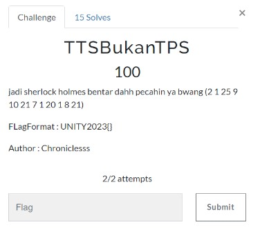
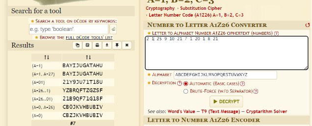

# TTSBukanTPS

> jadi sherlock holmes bentar dahh pecahin ya bwang (2 1 25 9 10 21 7 1 20 1 8 21) 



## Solve

Diberikan angka 2, 1, 25, dan seterusnya. Jika dilihat susunan angka ini tidak melebihi angka 26 yang berarti ini adalah A1Z267 cipher. Dan untuk menyelesaikan soal ini bisa dengan menggunakan website [Dcode.fr](https://www.dcode.fr/letter-number-cipher)



Flag sudah bisa kita dapatkan dengan format lowercase

```
UNITY2023{bayijugatahu}
```