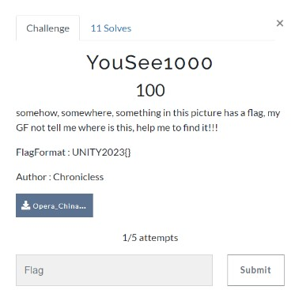
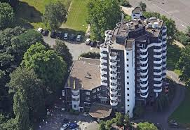
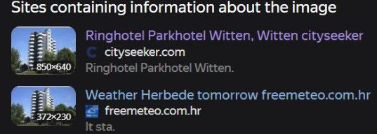
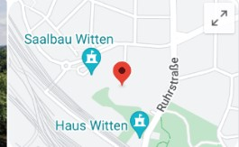
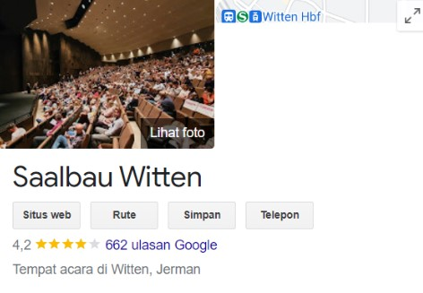
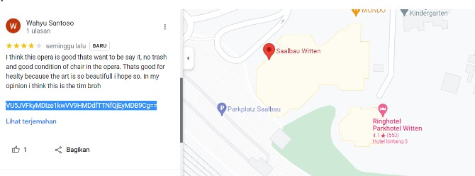
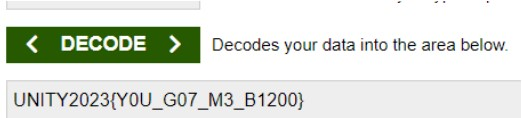

# YouSee1000

> somehow, somewhere, something in this picture has a flag, my GF not tell me where is this, help me to find it!!



## Solve

Diberikan sebuah gambar seperti ini



Berdasarkan pada deskripsi soal kita harus mencari nama tempat tersebut, sesuai dengan arahan pada soal mengacu pada review tempat tersebut.

Kita gunakan yandex images untuk mencari tahu nama tempat nya



Sepertinya kita sudah dapat nama tempatnya yaitu “Ringhotel Parkhotel Witten” langsung saja kita pergi ke mapsnya untuk mencari review.

Namun setelah lama mencari tidak ada tanda - tanda flag yang tercantum walau sudah mencari di berbagai platform review.

Setelah itu saya sadar dengan nama file gambar tersebut adalah “Opera……” langsung saja saya tambahkan kata kunci Opera pada mesin pencari google “Ringhotel Parkhotel Witten near Opera”



Terdapat tempat yang lumayan dekat dengan hotel, kita coba check



Seperti yang kita lihat tempat tersebut merupakan opera yang ada di dekat hotel, oleh karena itu kita coba lihat reviewnya.

Setelah mencari beberapa waktu kita mendapatkan review yang sangat sus sekali



Kita mendapatkan base64

“VU5JVFkyMDIze1kwVV9HMDdfTTNfQjEyMDB9Cg==”

Lalu kita coba decode



```
UNITY2023{Y0U_G07_M3_B1200}
```